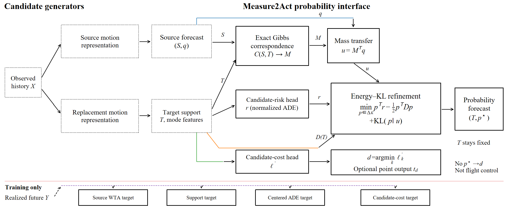

# Measure2Act

**Research software and reproducibility package for _Measure2Act: Modular
probability transfer for multimodal aircraft trajectory prediction_, prepared
for _Aerospace Science and Technology_.**

Canonical repository: <https://github.com/xubeiyou-fate/Measure2Act>

[Method](#key-design) | [Results](#reported-result) |
[Quick start](#quick-start) | [Paper reproduction](#paper-reproduction) |
[Data access](#data-access) | [Repository map](docs/CODE_MAP.md) |
[Project structure](docs/PROJECT_STRUCTURE.md) |
[AST submission context](docs/AST_SUBMISSION.md) |
[Publication audit](docs/PUBLICATION_AUDIT.md) |
[Citation](#citation)

> **Upload status:** the source-only tree is ready to upload to a public GitHub
> repository. The repository has been created at
> `https://github.com/xubeiyou-fate/Measure2Act`, but the `main` ref still
> requires a GitHub token with the `workflow` scope. Large data and model
> assets remain in their separate official or DOI records; the final version
> tag still requires the resolving repository, DOI, and release metadata.

## Overview

Measure2Act is a modular probability interface for multimodal aircraft
trajectory forecasting. It transfers probability mass from a source support to
an independently generated replacement support, then refines the transported
prior while leaving the replacement trajectories unchanged. The released code
separates candidate generation, correspondence, probability assignment, and
evaluation so that probability gains can be tested on a fixed support.



_Method workflow from the submitted manuscript. The target support remains
fixed throughout the probability stage; the optional point output is not a
flight-control command._

## Key design

- **Uncertain correspondence:** exact Gibbs marginalization represents
  ambiguity between unordered source and target trajectory supports.
- **Mass-preserving transfer:** source probability is transported through the
  correspondence marginal and remains on the probability simplex.
- **Energy-KL refinement:** target-specific predicted risk and target geometry
  refine the transported prior through a strictly convex objective.
- **Fixed-support evaluation:** probability changes are evaluated without
  changing the replacement trajectories, separating probability assignment
  from candidate coverage.

The stable public interface is implemented in
`Measure2Act_probability_transfer/`; the frozen study implementations and
protocols remain available for paper reconstruction. See
[docs/CODE_MAP.md](docs/CODE_MAP.md) for the conceptual map.

## Reported result

In the manuscript's retrospective, airport-balanced fixed-support evaluation,
Measure2Act reduced time-marginal and full-path Energy Scores by **11.70%** and
**11.69%**, respectively, relative to the target branch's native
decision-logit softmax. The five replacement trajectories were unchanged in
this comparison. These are retrospective research results, not operational
flight-guidance validation.

The compact index at [results/RESULTS_MASTER.csv](results/RESULTS_MASTER.csv)
is provided for orientation. Small aggregate CSVs for manuscript Tables 3-7
and their checksums are included under
[results/paper_tables/](results/paper_tables/). They contain no trajectories
or per-flight records.

## Quick start

Python 3.11 is the validated reference environment. The following path is
CPU-only and requires no research data or model weights.

```bash
python -m venv .venv
. .venv/bin/activate
python -m pip install --upgrade pip
python -m pip install -c constraints/requirements-cpu.txt ".[test]"
python -m pytest -q
python -m Measure2Act_probability_transfer.run --smoke
```

Minimal API example:

```python
import torch

from Measure2Act_probability_transfer import energy_kl_projection, support_cost

source = torch.zeros(1, 5, 4, 3, dtype=torch.float64)
target = source.clone()
source_probability = torch.full((1, 5), 0.2, dtype=torch.float64)
correspondence_cost = support_cost(source, target)

probability, _ = energy_kl_projection(
    source_probability,
    correspondence_cost.diagonal(dim1=1, dim2=2),
    torch.zeros(1, 5, 5, dtype=torch.float64),
)
assert torch.allclose(probability.sum(dim=1), torch.ones(1, dtype=torch.float64))
```

Equivalent Conda and container definitions are provided in `environment.yml`
and `Dockerfile`. For the exact validated environment, install
`requirements-lock.txt` first and then install the project without dependency
resolution:

```bash
python -m pip install -r requirements-lock.txt
python -m pip install --no-deps .
```

## Data access

No third-party raw or derived trajectory dataset is hosted in this repository.
TrajAir version 1 is obtained from its official
[KiltHub DOI](https://doi.org/10.1184/R1/14866251.v1). TartanAviation is
obtained through its official `adsb/download.py` at the frozen study commit
`4065f5bb11c3d8e557dcaf20a56469e6b0738714`. Exact file URLs, upstream MD5
values, study SHA256 values, licences, and acquisition commands are documented
in [docs/DATASETS.md](docs/DATASETS.md) and the machine-readable
[source registry](docs/dataset_sources.csv).

The download helper defaults to a no-network dry run and refuses to place
datasets inside the Git checkout:

```bash
python scripts/fetch_official_data.py --list
python scripts/fetch_official_data.py \
  --dataset trajair --asset 111_days.zip \
  --destination /path/to/external-data/trajair
```

Add `--accept-upstream-terms --execute` only after reviewing the upstream
record. TartanAviation's verified repository licence covers source code; the
downloaded ADS-B payload has no separately stated licence on the verified
official pages, so it must not be redistributed without custodian permission.

## Paper reproduction

The release uses a citable software archive, a separate model-weight record,
and the official upstream dataset records. Large research assets are
deliberately excluded from Git history.

| Level | Required objects | Verification entry point |
|---|---|---|
| Source-only | GitHub repository | `python -m pytest -q` and `measure2act-operator --smoke` |
| Tables 3-7 aggregate values | GitHub repository | `python scripts/verify_paper_summaries.py` |
| Evaluation/retraining | Official upstream datasets and model record | Frozen protocols and paths in [docs/REPRODUCIBILITY.md](docs/REPRODUCIBILITY.md) |

The final release must replace these explicit gates with resolving records:

- Software archive: `[SOFTWARE_DOI_PENDING]`
- Model weights: `[MODEL_DOI_PENDING]`; see the machine-readable
  [external model release contract](model_release.json)

A separate Measure2Act data DOI is not required for this GitHub strategy:
reused datasets are cited at their official sources, and the repository's
aggregate evidence is archived with the software release. A data DOI should
be created only if the authors later publish a distinct, rights-cleared
author-generated evidence dataset. The model record contains the exact paper
checkpoints, per-weight SHA256 values, configuration bindings, seeds, and
protocol mappings.

The source and dependency boundary is summarized in
[THIRD_PARTY_LICENSE_MATRIX.md](docs/THIRD_PARTY_LICENSE_MATRIX.md). The 60
core model rows are bound to the official ASCENT repository and pinned commit
in [model_release.json](model_release.json); the separate matrix records
additional upstream provenance for the model utility code.

For a new ASCENT run after the approved assets are materialized:

```bash
measure2act-train \
  --dataset_folder /path/to/external-data \
  --dataset_name tartan_kagc_processed_official \
  --output_folder /path/to/new/runs \
  --obs 11 --preds 120 --k 5

measure2act-evaluate \
  --dataset_folder /path/to/external-data \
  --dataset_name tartan_kagc_processed_official \
  --exp_folder /path/to/model-record/run-directory \
  --epoch 20
```

New runs are not substitutes for the frozen paper protocols. Do not overwrite
the archived evidence.

## Repository layout

```text
Measure2Act_probability_transfer/  Stable finite-measure operator interface
Measure2Act_forecasting/           ASCENT training and evaluation entry points
mabpt/                             Core Gibbs and Energy-KL implementation
measure2act_ast_tools/             Final AST evaluation and aggregation tools
experiments/                        Frozen paper experiment implementations
model/                             ASCENT model implementation
modern_baseline/                   Local adapters; no upstream EqMotion source
results/                           Small aggregate manuscript evidence
docs/                              Scope, structure, data, model, and release docs
scripts/                           Data, manifest, and readiness utilities
tests/                             Data-free public tests
sbom/                              CycloneDX dependency inventory
```

The complete annotated tree is in
[docs/PROJECT_STRUCTURE.md](docs/PROJECT_STRUCTURE.md).

Experiment package paths are descriptive and grouped under `experiments/`.
Frozen protocol metadata remains inside each package, and the packages are
indexed by role in [docs/CODE_MAP.md](docs/CODE_MAP.md).

## Release status

This tree is a `v1.0.0` release candidate. Before a public push or tag:

1. retain the root `LICENSE` for original Measure2Act material and the ASCENT
   attribution in `docs/ASCENT_NOTICE.md`; verify that the workflow figure is
   author-created before creating the version tag;
2. approve the model terms, verify all official dataset citations and access
   conditions, and keep the internal data mother archive out of GitHub;
3. reserve resolving software and model identifiers;
4. update `README.md`, `CITATION.cff`, repository metadata, and the manuscript
   availability statements with the same identifiers;
5. run `python scripts/audit_release_readiness.py --strict` and the complete
   clean-clone verification before creating the version tag.

The canonical GitHub repository is
<https://github.com/xubeiyou-fate/Measure2Act>. The software DOI, model DOI,
and publication date are added only after the corresponding archive records
resolve.

## Third-party boundary

ASCENT, TartanAviation, TrajAir, EqMotion, and Python dependencies remain under
their respective terms. ASCENT attribution and the pinned source commit are in
`docs/ASCENT_NOTICE.md`; official EqMotion source is not vendored. The complete
code/data/model boundary is in [docs/ASSET_BOUNDARY.md](docs/ASSET_BOUNDARY.md),
and dependency versions are recorded in the [SBOM](sbom/README.md).

## Scope and safety

The evidence is retrospective, airport-specific, and based on a fixed
five-trajectory support. This software is research code. It is not certified
for operational flight guidance, air-traffic control, or any other
safety-critical use.

## Citation

The verified author and software metadata are in [CITATION.cff](CITATION.cff).
The repository URL, release date, article identifier, and archive DOI must be
added only after the corresponding records exist. GitHub will expose the
finalized file through its **Cite this repository** interface.

## Contributing and security

See [CONTRIBUTING.md](CONTRIBUTING.md) for the asset boundary and validation
steps and [CODE_OF_CONDUCT.md](CODE_OF_CONDUCT.md) for participation
expectations. Report security-sensitive issues using [SECURITY.md](SECURITY.md),
not a public issue containing private data, credentials, or restricted
trajectories.
